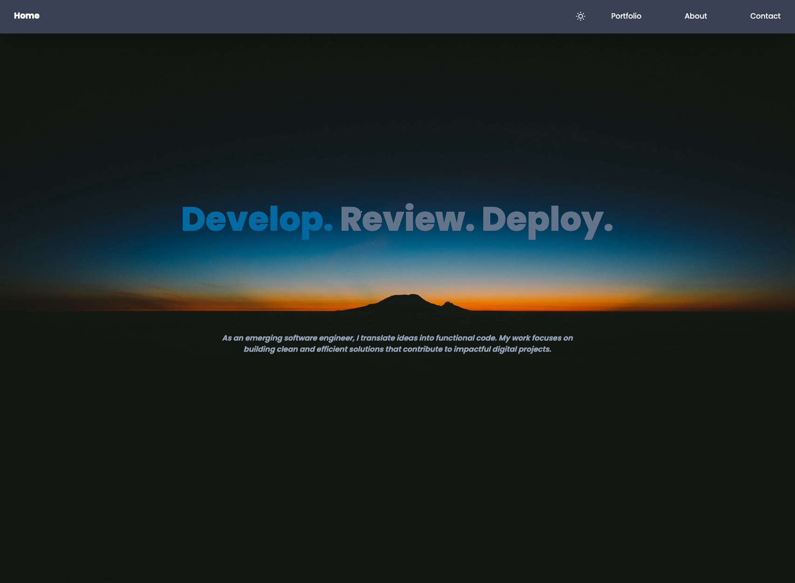
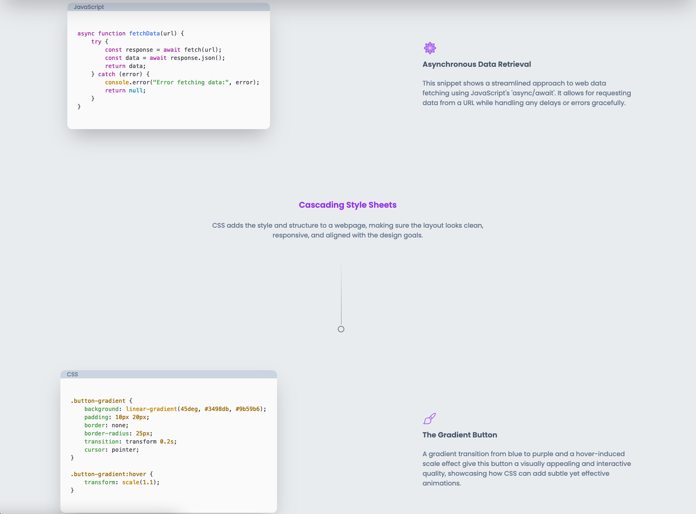
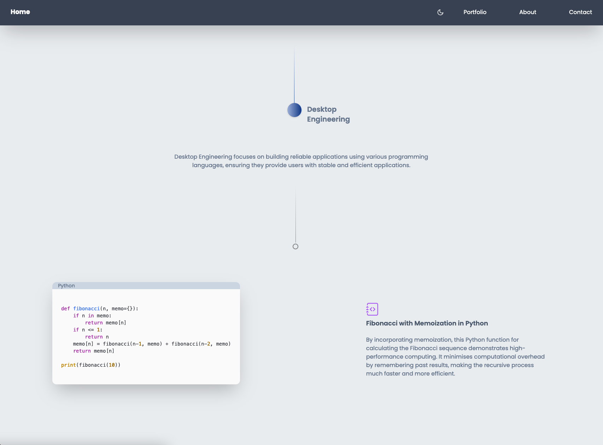
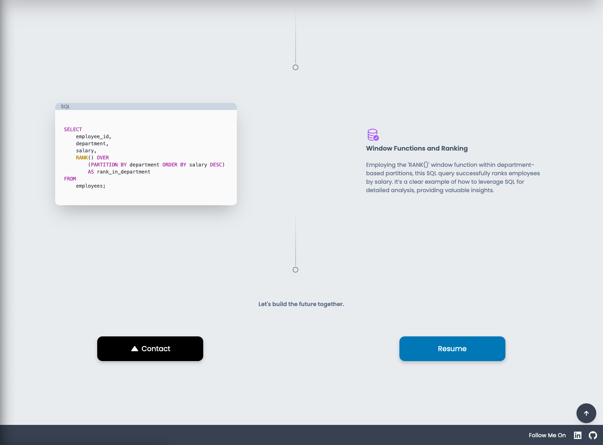
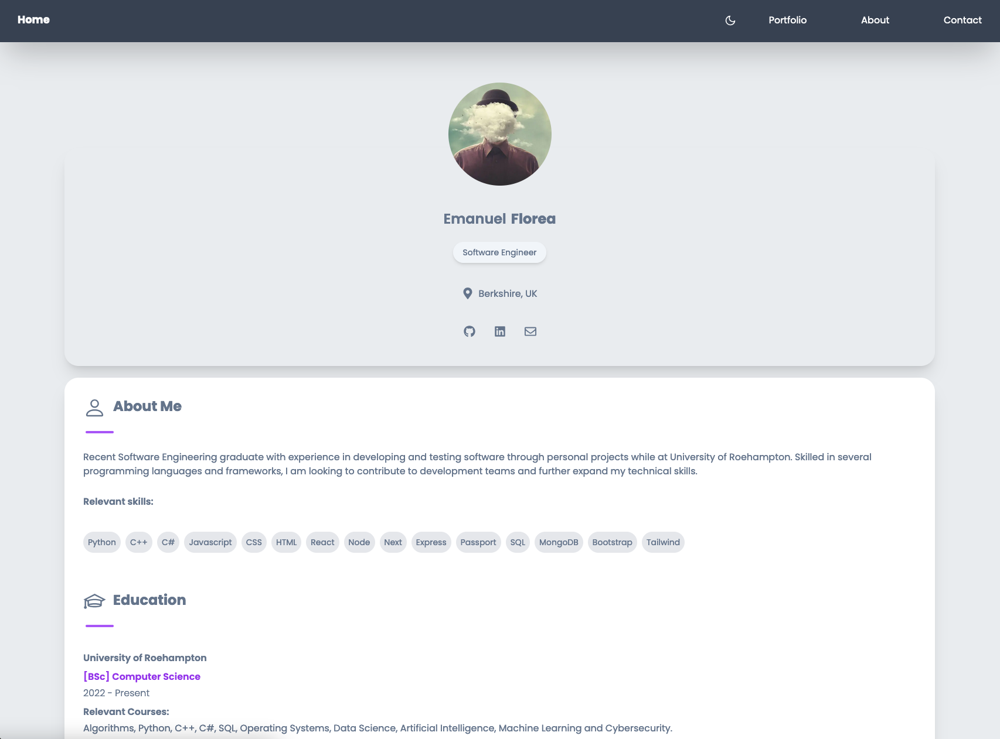
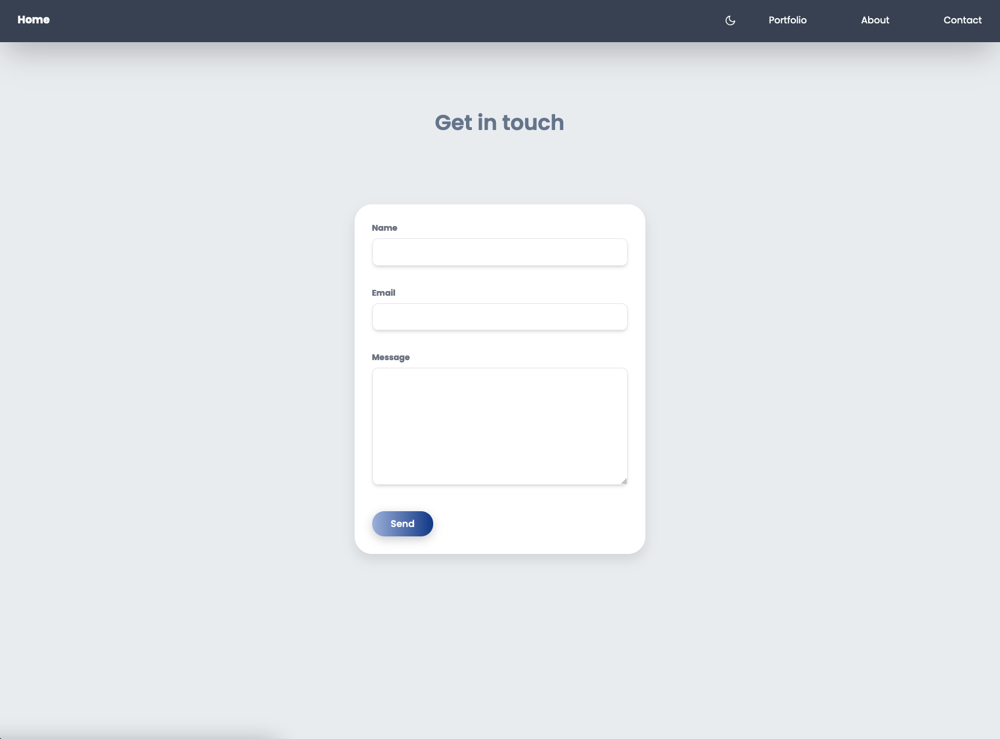

# Develop. Review. Deploy.

A web application developed using the Next.js framework including React, Node, CSS, Tailwind, and SMTP for messaging. The website includes sections for a landing page (Home), About Me, Portfolio, and Contact information. 
It features a simple but modern design and uses various web development technologies.


## Table of Contents

- [About the Project](#about-the-project)
- [Features](#features)
- [Technologies Used](#technologies-used)
- [Screenshots](#screenshots)
- [Getting Started](#getting-started)
- [Usage](#usage)
- [Contact](#contact)


## About the Project

This portfolio website serves as an online resume and project showcase. The website is responsive and includes a night mode for a better user experience.


## Features

- Introduction section with a tagline
- Technology showcase with icons and descriptions
- Detailed "About Me" section with resume information
- Portfolio section (future projects to be added)
- Contact form using SMTP for messages
- Footer with social media links
- Night mode for better user experience


## Technologies Used

- **Next.js**: A React framework for server-rendered applications.
- **React**: A JavaScript library for building user interfaces.
- **Node.js**: A JavaScript runtime built on Chrome's V8 JavaScript engine.
- **CSS**: Cascading Style Sheets for styling.
- **Tailwind CSS**: A utility-first CSS framework.
- **SMTP**: Simple Mail Transfer Protocol for messaging.


## Screenshots

### Home Page with Night Mode On (rest of the screenshots has Light Mode On)


### CSS Example


### Desktop Engineering


### Footer


### About Page


### Contact Section



## Header Images

Both images, Light and Dark, are from Unsplash and all the credit goes to:

- Light Mode: [Dominik Schröder](https://unsplash.com/photos/white-clouds-during-daytime-FIKD9t5_5zQ)

- Dark Mode: [Elliott Engelmann](https://unsplash.com/photos/silhouette-of-mountain-DjlKxYFJlTc)


## Getting Started

To get a local copy and running follow these simple steps.


### Prerequisites

- Node.js and npm installed on your local machine.


### Installation

1. Clone the repo
   ```sh
   git clone https://github.com/OldManny/Develop.Review.Deploy.git

2. Install NPM packages
   ```sh
   npm install

3. Run the development server
   ```sh
   npm run dev

## Usage

- [Website](https://develop-review-deploy.vercel.app/)
  

## Contact

- [LinkedIn](https://www.linkedin.com/in/emanuel-florea-4a44bb299/)
- [Email](mailto:emanuel.ion.florea@gmail.com) 


